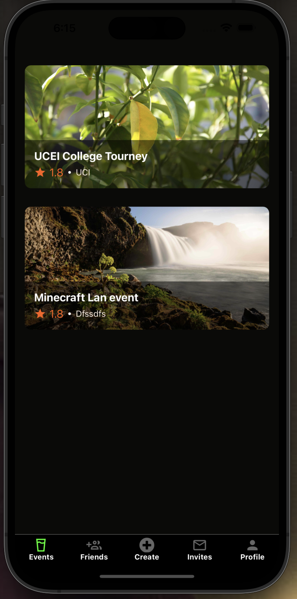
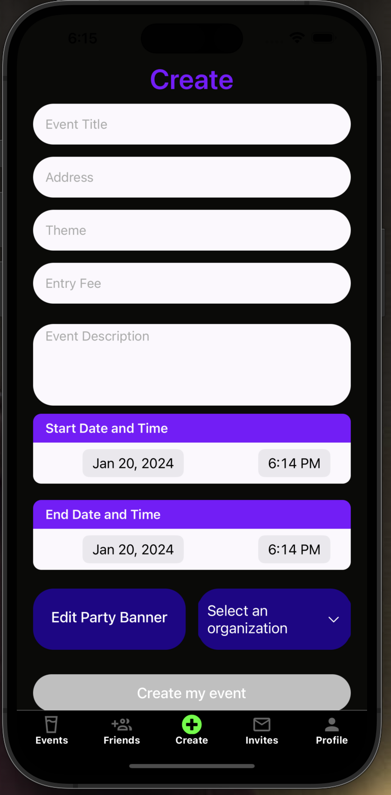
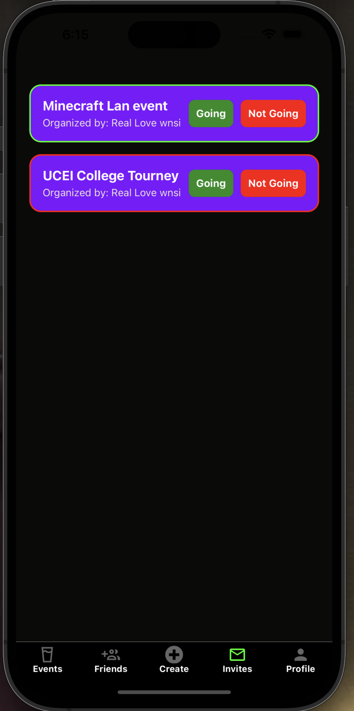

# RSVP Now

<!--  -->

## Key Features:

### User Profile:

- Personalize and update your profile to your liking, while also managing events and organizations you've joined or created.

### Build Your Network:

- Find and add friends by searching their username or browsing suggested friends matched by mutual organizations and events attended.
- Scroll on the friends page to see their status updates and click on their profiles to learn more about them!

### Planning Made Easy:

- Tired of not knowing what parties are happening this weekend? The home page displays all upcoming events, organized by date and filterable by type of event and host.
- Check your invites tab to see if a host has added you to the guest list for a closed event and RSVP!
- Create events for yourself or your organization using our curated template to specify all necessary information.

### Location Search:

- Browse events in your area using our updated map that shows you what’s currently happening near you.

## Screenshots:

  
  
  

